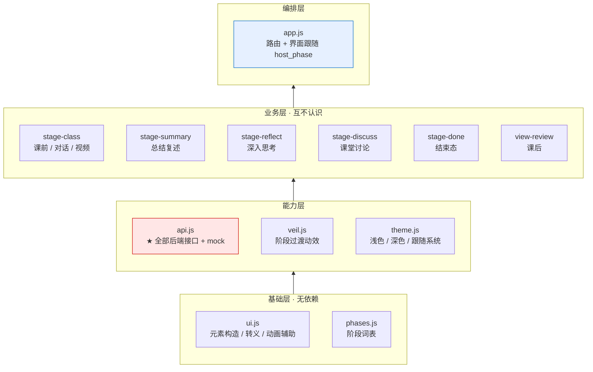
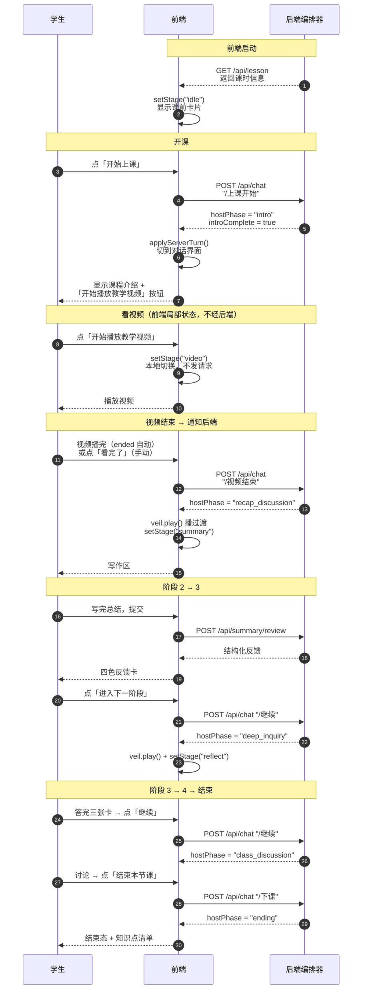
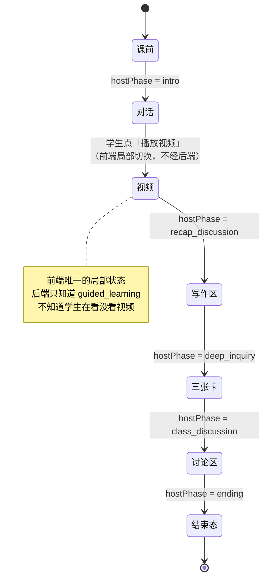
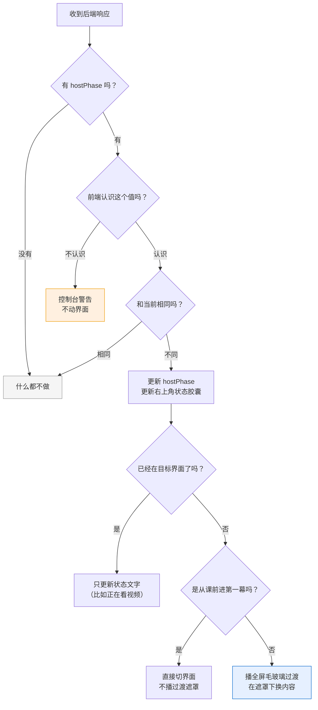
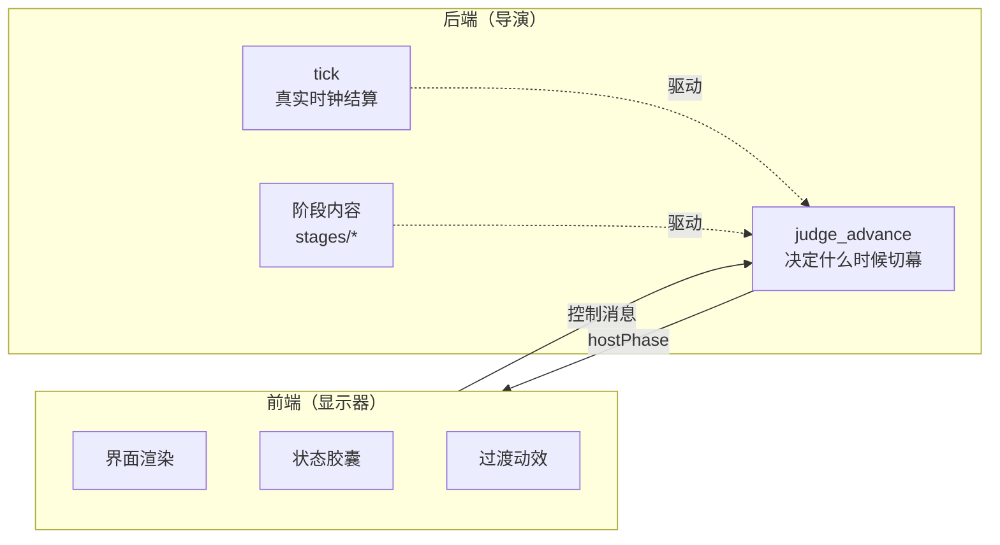

# 前端架构与运行流程

学生端 AI 课堂前端。**零依赖、零构建**，源码就是运行代码。

**前端是块显示屏，后端是导演。** 演到哪一幕由后端的 `host_phase` 决定，前端只负责把它显示出来。

教学模型是「一节课 4 个阶段」：引导学习 → 总结复述 → 深入思考 → 课堂讨论。

---

## 技术选型：为什么不用框架

| | 传统 React/Vue 项目 | 本项目 |
| --- | --- | --- |
| 依赖 | 几百 MB `node_modules` | **0** |
| 构建 | `npm install` + 打包器 | **无** |
| 启动 | 装依赖、起 dev server | `node serve.mjs` 或双击 `start.cmd` |
| 部署 | 构建产物 + 静态托管 | **源码就是运行代码** |

做法是用**浏览器原生的 ES 模块** —— `import` 直接写相对路径，浏览器自己解析，不需要打包器。

**代价**：不能双击 `index.html` 打开（`file://` 协议下 ES 模块和 `fetch` 都会被拦），必须走 HTTP。

**收益**：任何装了 Node 的机器，clone 下来一句命令就能跑，没有"环境不对"这一说。

---

## 一、分层架构

依赖关系**单向向上**。`ui.js` 和 `phases.js` 没有任何依赖，只有 `app.js` 认识所有模块。



**两条关键设计**：

1. **各阶段模块之间互不认识。** `stage-summary` 不知道 `stage-reflect` 存在 —— 它们只跟 `ctx`（app.js 传进去的接口）打交道。**加一个新阶段不用改任何现有阶段模块。**
2. **所有后端调用都收在 `api.js`。** 各模块只 import 函数，不写 URL。换后端只动这一个文件。

---

## 二、一次课堂的完整流程



**注意每一步的模式都一样**：前端发一句话 → 后端返回 `hostPhase` → 前端比对 → 变了才切。

---

## 三、界面状态机

界面由 `host_phase` 映射得到，但**视频是前端唯一的局部状态**（同一幕内部的第二屏）。



**为什么视频是局部状态**：后端的 `guided_learning` 这一幕本身就包含「讲课 + 看视频」两段，视频是它内部的事。学生点播放时前端自己切，播完**才**通知后端。

---

## 四、核心机制：`applyServerTurn()`

整个「完全跟随」就落在这一个函数里。**每次拿到后端响应都会走一遍。**



几个分支都有理由：

| 分支 | 为什么 |
| --- | --- |
| **不认识的值** | 后端将来加新阶段时，旧前端不会崩，只少显示一幕 |
| **已经在目标界面** | 视频是 `guided_learning` 的内部状态，别把学生正在看的视频打断 |
| **第一幕不播遮罩** | 那是「开课」不是「切幕」，播遮罩反而奇怪 |

---

## 五、模块清单

| 文件 | 行数 | 职责 |
| --- | ---: | --- |
| `js/api.js` | 492 | **全部后端接口 + mock** —— 对接后端只改这一个文件 |
| `js/app.js` | 385 | 编排层：路由 + 界面跟随 `host_phase` |
| `js/stage-class.js` | 350 | 课前 / AI 对话 / 教学视频 |
| `js/stage-discuss.js` | 219 | 课堂讨论（老师 / 同学 / 我 三种角色） |
| `js/stage-summary.js` | 215 | 总结复述（写作区 + 结构化反馈） |
| `js/stage-reflect.js` | 195 | 深入思考（三张卡逐个展开） |
| `js/theme.js` | 188 | 浅色 / 深色 / 跟随系统 |
| `js/ui.js` | 92 | 共用工具：元素构造、转义、动画辅助 |
| `js/phases.js` | 63 | **阶段词表** —— `host_phase` 与界面的唯一映射 |
| `js/veil.js` | 46 | 阶段过渡动效 |
| `js/stage-done.js` | 45 | 结束态 |
| `js/view-review.js` | 25 | 课后（内容待定） |
| `index.html` | 374 | 全部页面结构 |
| `styles.css` | 1778 | 设计系统（Apple HIG） |
| `serve.mjs` | 146 | 本地预览服务器（支持 Range，视频能拖进度条） |

**合计 4613 行，零依赖、零 `node_modules`。**

### 阶段模块的统一契约

每个阶段模块只暴露四个方法：

```js
export function createStage(ctx) {
  return {
    mount(),          // 首次挂载：绑事件，只调一次
    enter(stageName), // 进入该界面
    leave(),          // 离开（清理定时器、停掉在途请求）
    reset()           // 换课时清空状态
  };
}
```

`ctx` 是 app.js 注入的接口，提供 `sessionId` / `getLesson()` / `applyServerTurn()` / `sendControl()` / `setStatus()` 等。

---

## 六、与后端的关系



四类接口、四条控制消息：

| 控制消息 | 什么时候发 | 期望后端行为 |
| --- | --- | --- |
| `/上课开始` | 学生点「开始上课」 | 进 `intro`，返回课程介绍 |
| `/视频结束` | 视频播完，或点「看完了」 | 进 `recap_discussion` |
| `/继续` | 学生点「进入下一阶段」 | 由 `judge_advance` 判定是否推进 |
| `/下课` | 学生点「结束本节课」 | 进 `ending`，返回收尾发言 |

**「学生手动进入下一阶段」保留着，但推不推由后端决定** —— 前端只负责发请求、然后跟随 `hostPhase`。

后端的实现在 `ORCHESTRATOR.md`：它用**真实墙上时钟**判断该不该切幕（每幕有预算时长，`tick` 算真实耗时，`judge_advance` 按「耗时 + 证据 + 老师配的策略」判定）。**前端完全不需要知道这些细节。**

**`sessionId` 是后端 checkpointer 的 `thread_id`**，前端已改成持久化存储（`localStorage`），刷新页面沿用同一个，这样后端才能从上一轮状态恢复。

---

## 七、演示顺序建议

| 步骤 | 展示什么 |
| --- | --- |
| 1. 入口 | 两张卡、右上角外观切换（试着切成浅色） |
| 2. 开始上课 | 状态胶囊变「课程介绍」，AI 返回介绍 |
| 3. 播放视频 | 拖进度条（证明支持 Range）、播完自动跳下一幕 |
| 4. 阶段过渡 | 那个全屏毛玻璃切换，是切幕时播的 |
| 5. 写作区 → 反馈 | 四色反馈卡 |
| 6. 三张卡 → 讨论区 → 结束态 | |

想强调「前端跟随后端」的话，**打开网络面板** —— 每次切幕前都有一个 `/api/chat` 请求，`hostPhase` 就在响应里。

---

## 附：本地启动

```bash
node serve.mjs               # → http://127.0.0.1:5173
PORT=8080 node serve.mjs     # 换端口
```

Windows 上双击 `start.cmd` 即可，它会检查 Node、把地址复制到剪贴板。

> ⚠️ 不能直接双击 `index.html`。页面用了 ES 模块和 `fetch`，`file://` 协议下都会被浏览器拦。

接口契约、请求响应示例、后端需要补齐的能力清单，见 [后端接口说明.md](../后端接口说明.md)。
