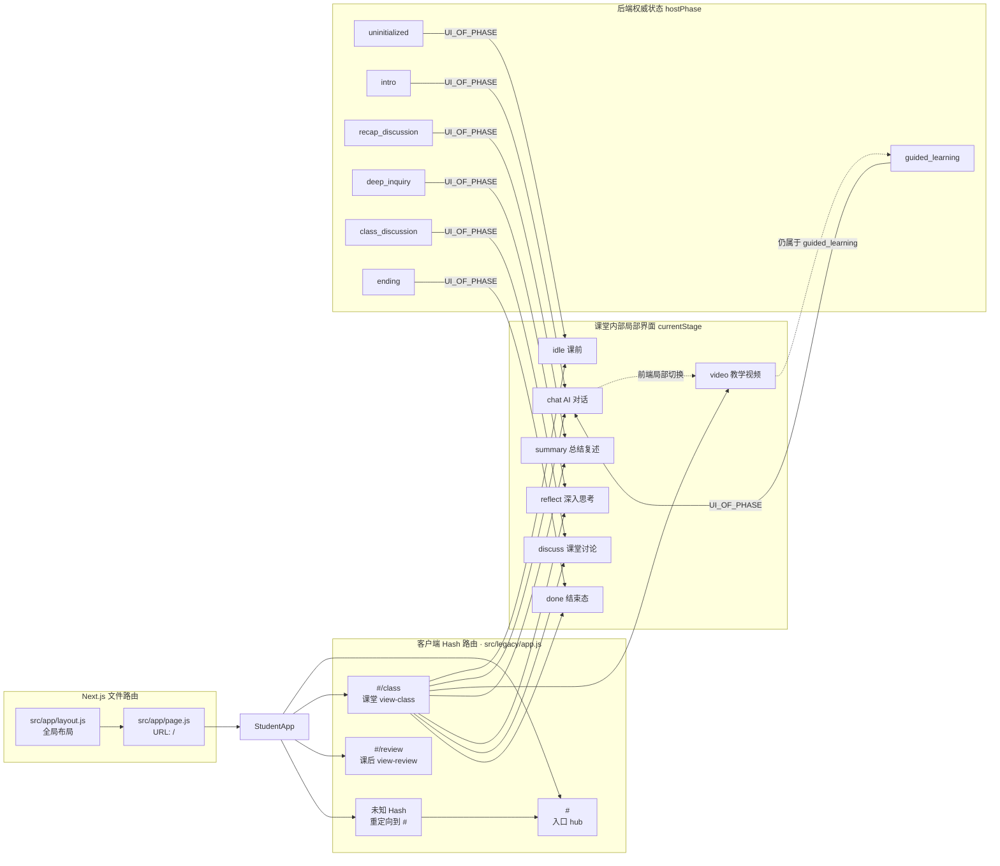
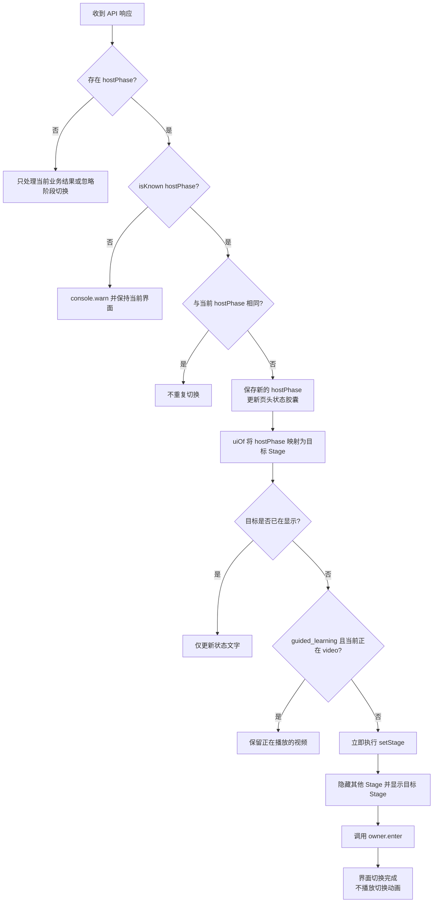
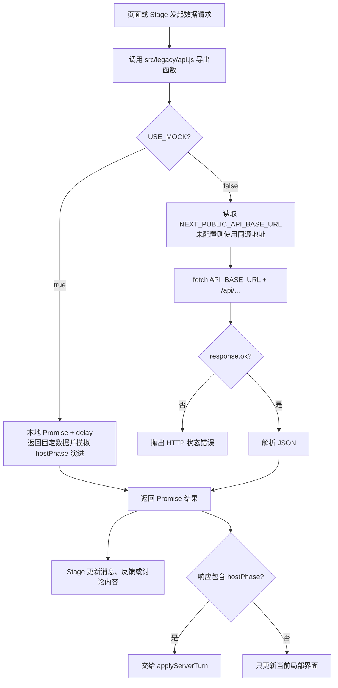

# Next.js 学生端前端工作流程

本文描述当前学生端在 Next.js App Router 下从浏览器请求、React hydration、Hash 路由、课堂状态切换到后端 API 的完整工作流程。

> 当前只有一个 Next.js 文件路由 `/`。课堂与课后仍由客户端 Hash 路由 `#`、`#/class`、`#/review` 管理。课堂内部阶段不属于 URL 路由，而是由后端返回的 `hostPhase` 驱动。

## 1. 完整前端工作流程

```mermaid
flowchart TD
    U[用户访问站点] --> NREQ[浏览器请求 GET /]

    subgraph NEXT["Next.js App Router · 服务端/构建阶段"]
        LAYOUT["src/app/layout.js<br/>RootLayout"]
        THEME_BOOT["head 内联主题脚本<br/>读取 localStorage 和系统主题<br/>设置 html[data-theme]"]
        GLOBAL_CSS["加载 src/app/globals.css"]
        PAGE["src/app/page.js<br/>HomePage Server Component"]
        STATIC["生成 / 的预渲染 HTML<br/>生产构建结果为静态路由"]

        LAYOUT --> THEME_BOOT
        LAYOUT --> GLOBAL_CSS
        LAYOUT --> PAGE
        PAGE --> STATIC
    end

    NREQ --> STATIC
    STATIC --> FIRST_PAINT[浏览器显示首屏 HTML]

    subgraph CLIENT["React 客户端启动"]
        HYDRATE[React hydration]
        STUDENT["StudentApp Client Component"]
        MARKUP["注入 legacyMarkup<br/>入口、课堂、课后"]
        EFFECT["useEffect 执行"]
        DYNAMIC["动态 import src/legacy/app.js"]
        READY["模块加载成功<br/>data-app-ready = true"]

        HYDRATE --> STUDENT
        STUDENT --> MARKUP
        STUDENT --> EFFECT
        EFFECT --> DYNAMIC
        DYNAMIC --> READY
    end

    FIRST_PAINT --> HYDRATE

    subgraph BOOT["课堂兼容层初始化 · src/legacy/app.js"]
        SESSION["读取 ai-learn.sessionId<br/>不存在则生成 UUID 并写入 localStorage"]
        CREATE["创建 themeSwitch 和各 stage 实例"]
        OWNERS["owners 注册<br/>idle/chat/video 共用 classStage<br/>summary、reflect、discuss、done、review"]
        MOUNT["每个唯一 owner 只 mount 一次<br/>绑定点击、提交、键盘和视频事件"]
        ROUTE_LISTEN["监听 hashchange<br/>入口卡片、返回按钮和 Esc"]
        ROUTE_FIRST[首次执行 renderRoute]

        SESSION --> CREATE --> OWNERS --> MOUNT --> ROUTE_LISTEN --> ROUTE_FIRST
    end

    DYNAMIC --> SESSION
    ROUTE_FIRST --> ROUTER

    subgraph HASH["客户端 Hash 路由"]
        ROUTER{parseHash 结果}
        HUB["# 或空 Hash<br/>显示 hub 入口页<br/>显示主题切换器"]
        CLASS["#/class<br/>调用 openLessonRoute<br/>隐藏主题切换器"]
        REVIEW["#/review<br/>显示课后 view<br/>调用 reviewView.enter"]
        UNKNOWN["其他 Hash<br/>location.replace #"]

        ROUTER -->|空| HUB
        ROUTER -->|class| CLASS
        ROUTER -->|review| REVIEW
        ROUTER -->|未知| UNKNOWN
        UNKNOWN --> HUB
    end

    HUB -->|点击课堂卡片| HASH_CLASS[location.hash = #/class]
    HUB -->|点击课后卡片| HASH_REVIEW[location.hash = #/review]
    HASH_CLASS --> ROUTE_EVENT[触发 hashchange]
    HASH_REVIEW --> ROUTE_EVENT
    ROUTE_EVENT --> ROUTER
    REVIEW -->|返回按钮或 Esc| HASH_HOME[location.hash = 空]
    HASH_HOME --> ROUTE_EVENT

    CLASS --> LESSON_FLOW

    subgraph LESSON["进入课堂与加载课时"]
        LESSON_FLOW{lesson 已缓存?}
        KEEP["是：保留课堂进度<br/>恢复 currentStage"]
        IDLE["否：显示 idle 课前页<br/>禁用开始按钮"]
        FETCH_LESSON["fetchLesson lessonId"]
        API_LESSON["GET /api/lesson<br/>或本地 Mock"]
        LESSON_OK["填充课程名称、摘要、知识点数、视频数、时长<br/>启用开始按钮"]
        LESSON_FAIL["显示载入失败<br/>Toast 错误信息"]

        LESSON_FLOW -->|是| KEEP
        LESSON_FLOW -->|否| IDLE
        IDLE --> FETCH_LESSON --> API_LESSON
        API_LESSON -->|成功| LESSON_OK
        API_LESSON -->|失败| LESSON_FAIL
    end

    LESSON_OK --> START_ACTION
    KEEP --> CURRENT_STAGE[继续当前课堂阶段]

    subgraph CLASSROOM["课堂四阶段业务流程"]
        START_ACTION["点击开始上课<br/>发送控制消息 /上课开始"]
        CHAT_API_1["POST /api/chat"]
        INTRO_RES["响应 message + hostPhase=intro<br/>introComplete=true"]
        APPLY_1[applyServerTurn]
        CHAT_STAGE["chat：课程介绍/引导学习<br/>显示 AI 消息和提问输入框"]
        VIDEO_ACTION[点击开始播放教学视频]
        VIDEO_FETCH["GET /api/lesson/video<br/>或 Mock 视频信息"]
        VIDEO_STAGE["video：创建 video 元素<br/>加载 /test_information/test_vedio.mp4"]
        VIDEO_END{视频如何结束?}
        VIDEO_NATURAL[自然播放结束 ended]
        VIDEO_MANUAL[点击 看完了继续]
        VIDEO_CONTROL["发送 /视频结束<br/>POST /api/chat"]
        RECAP_RES["hostPhase=recap_discussion"]
        SUMMARY_STAGE["summary：总结复述"]
        SUMMARY_WRITE[学生输入不少于 10 字]
        SUMMARY_API["POST /api/summary/review"]
        SUMMARY_FEEDBACK["显示 strengths、gaps、supplements、connections"]
        SUMMARY_CHOICE{学生选择}
        SUMMARY_REVISE[我再改一版]
        SUMMARY_NEXT["进入下一阶段<br/>发送 /继续"]
        DEEP_RES["POST /api/chat<br/>hostPhase=deep_inquiry"]
        REFLECT_STAGE["reflect：深入思考<br/>三张卡按顺序解锁"]
        REFLECT_CARD["每张卡填写不少于 6 字"]
        REFLECT_API["POST /api/reflection"]
        REFLECT_FEEDBACK["显示 verdict、comment、followUp"]
        REFLECT_DONE{三张卡都完成?}
        REFLECT_NEXT["显示进入课堂讨论按钮<br/>发送 /继续"]
        DISCUSS_RES["POST /api/chat<br/>hostPhase=class_discussion"]
        DISCUSS_STAGE["discuss：课堂讨论"]
        DISCUSS_LOAD["GET /api/discussion<br/>加载题目和老师/同学消息"]
        DISCUSS_POST["学生发言<br/>POST /api/discussion"]
        DISCUSS_FOLLOW["显示本人发言<br/>Mock 下追加老师追问"]
        DISCUSS_END["点击结束本节课<br/>发送 /下课"]
        END_RES["POST /api/chat<br/>hostPhase=ending"]
        DONE_STAGE["done：课程结束<br/>展示知识点清单"]
        TO_REVIEW["点击去看看掌握情况<br/>location.hash = #/review"]

        START_ACTION --> CHAT_API_1 --> INTRO_RES --> APPLY_1 --> CHAT_STAGE
        CHAT_STAGE --> VIDEO_ACTION --> VIDEO_FETCH --> VIDEO_STAGE --> VIDEO_END
        VIDEO_END -->|自然结束| VIDEO_NATURAL --> VIDEO_CONTROL
        VIDEO_END -->|手动结束| VIDEO_MANUAL --> VIDEO_CONTROL
        VIDEO_CONTROL --> RECAP_RES --> SUMMARY_STAGE
        SUMMARY_STAGE --> SUMMARY_WRITE --> SUMMARY_API --> SUMMARY_FEEDBACK --> SUMMARY_CHOICE
        SUMMARY_CHOICE -->|修改| SUMMARY_REVISE --> SUMMARY_WRITE
        SUMMARY_CHOICE -->|继续| SUMMARY_NEXT --> DEEP_RES --> REFLECT_STAGE
        REFLECT_STAGE --> REFLECT_CARD --> REFLECT_API --> REFLECT_FEEDBACK --> REFLECT_DONE
        REFLECT_DONE -->|否| REFLECT_CARD
        REFLECT_DONE -->|是| REFLECT_NEXT --> DISCUSS_RES --> DISCUSS_STAGE
        DISCUSS_STAGE --> DISCUSS_LOAD
        DISCUSS_LOAD --> DISCUSS_POST --> DISCUSS_FOLLOW --> DISCUSS_END
        DISCUSS_END --> END_RES --> DONE_STAGE --> TO_REVIEW
    end

    TO_REVIEW --> ROUTE_EVENT
```

## 2. 路由与界面状态关系

### 路由表

| 层级 | 地址/状态 | 展示内容 | 负责模块 |
| --- | --- | --- | --- |
| Next.js | `/` | 学生端应用入口 | `src/app/page.js` |
| Hash | `#` | 课堂/课后入口 | `src/legacy/app.js` |
| Hash | `#/class` | 课堂容器 | `src/legacy/app.js` |
| Hash | `#/review` | 课后占位页 | `src/legacy/view-review.js` |
| Hash | 其他值 | 替换为 `#` | `renderRoute()` |
| 课堂局部状态 | `idle/chat/video/...` | 对应课堂 Stage | `setStage()` |
| 后端权威状态 | `hostPhase` | 决定目标 Stage | `applyServerTurn()` |

## 3. 后端响应如何驱动界面切换

## 4. API 请求分流

### API 清单

| 前端函数 | 方法与地址 | 触发位置 | 主要结果 |
| --- | --- | --- | --- |
| `fetchLesson` | `GET /api/lesson` | 进入 `#/class` | 课程基本信息 |
| `sendChat` | `POST /api/chat` | 开课、提问、视频结束、继续、下课 | AI 消息与 `hostPhase` |
| `fetchLessonVideo` | `GET /api/lesson/video` | 点击播放教学视频 | 视频 URL 与元数据 |
| `advancePhase` | `POST /api/phase/advance` | 预留接口 | 目标 `hostPhase` |
| `reviewSummary` | `POST /api/summary/review` | 提交总结复述 | 结构化反馈 |
| `submitReflection` | `POST /api/reflection` | 提交思考卡片 | AI 点评与追问 |
| `fetchDiscussion` | `GET /api/discussion` | 首次进入课堂讨论 | 讨论题与消息流 |
| `postDiscussion` | `POST /api/discussion` | 学生发表讨论内容 | 新讨论消息 |
| `fetchDiscussionEnd` | `GET /api/discussion/end` | 预留接口 | 讨论结束信息 |

## 5. 关键设计边界

- Next.js 目前只负责 `/` 的入口、根布局、主题首屏脚本、全局样式和构建。
- Hash 路由负责入口、课堂、课后三个客户端视图，刷新和浏览器前进/后退仍可工作。
- `hostPhase` 是课堂阶段的唯一权威来源；前端按钮只发送控制消息，不自行决定进入哪个阶段。
- `chat → video` 是 `guided_learning` 内部的前端局部切换，不是新的后端阶段。
- 所有真实接口地址统一从 `NEXT_PUBLIC_API_BASE_URL` 拼接，业务 Stage 不直接写后端域名。
- 未识别的 `hostPhase` 和重复阶段响应都会被保护，避免课堂界面中断。
- Hash 页面、课堂 Stage、总结编辑/反馈视图均直接切换；消息、Toast、悬停等局部反馈动画仍保留。
