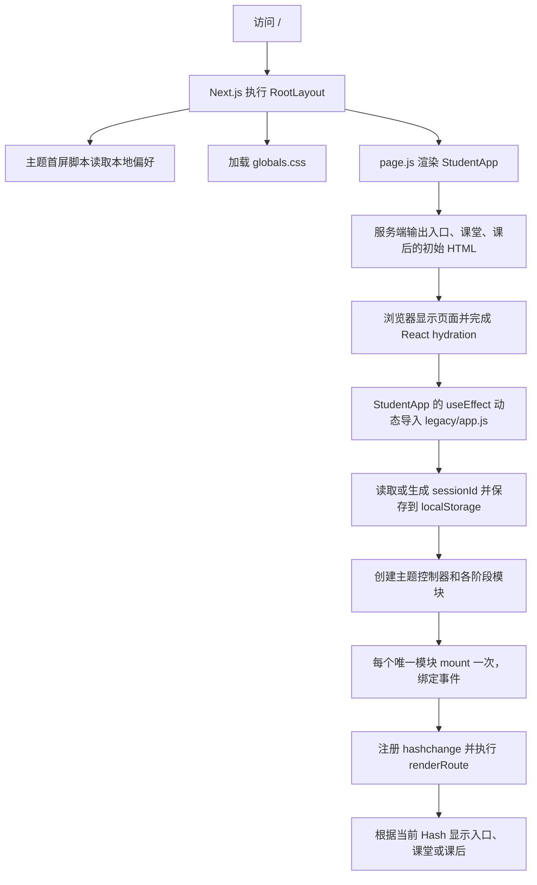
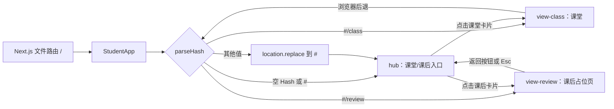
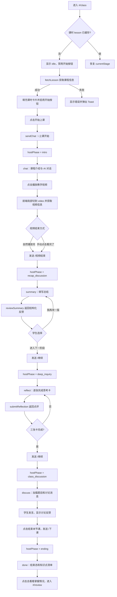
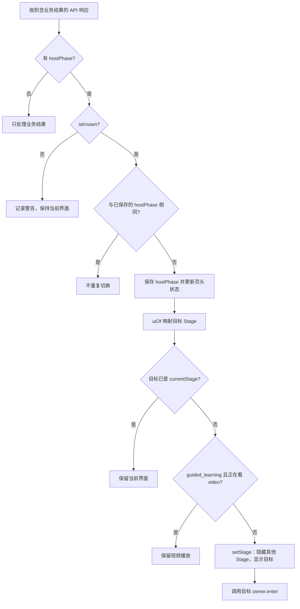
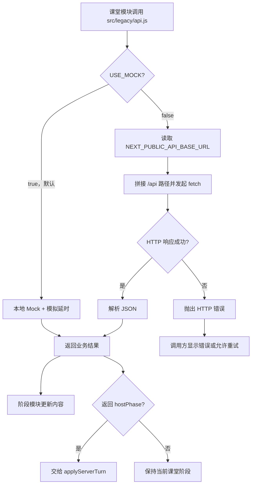

# Next.js 学生端前端流程图

本文是当前代码对应的流程图源文件，使用 Mermaid 编写；不依赖已删除的旧 SVG/HTML 导出。可在支持 Mermaid 的 Markdown 查看器中直接预览。

> 现状：Next.js App Router 只有 `/` 一个文件路由；入口、课堂和课后由浏览器 Hash 路由控制。课堂内的阶段由后端响应中的 `hostPhase` 决定，当前 `src/legacy/api.js` 默认使用 Mock。界面切换即时完成，不播放页面或阶段过渡动画。

## 1. 启动、渲染与客户端初始化

`src/app/layout.js` 负责布局、元数据、主题首屏脚本和全局 CSS；`src/app/page.js` 渲染 `StudentApp`。`StudentApp` 是 Client Component，保留现有页面结构，并在挂载后导入 `src/legacy/app.js`。初始 HTML 不等于课堂业务已加载；业务事件绑定发生在动态导入之后。

## 2. 路由与页面切换

| 地址或状态 | 控制者 | 结果 |
| --- | --- | --- |
| `/` | Next.js App Router | 加载学生端应用 |
| `#` 或空 Hash | `renderRoute()` | 显示入口和主题切换器 |
| `#/class` | `openLessonRoute()` | 显示课堂；首次进入时加载课时 |
| `#/review` | `renderRoute()` | 显示课后占位页 |
| 其他 Hash | `renderRoute()` | 回到入口 |
| `currentStage` | `setStage()` | 控制课堂内部的 `idle/chat/video/summary/reflect/discuss/done` |

Hash 切换直接修改显隐、焦点与滚动位置，不等待退场或入场动画。课堂没有页面内返回按钮，Esc 在课堂中不触发返回；浏览器自身的后退仍可改变 Hash。

## 3. 进入课堂与四阶段教学流程

图中 `hostPhase` 表示服务端响应的权威状态；默认 Mock 会模拟同样的字段。真实后端是否推进阶段由后端决定，前端的“继续”按钮只发控制消息。`chat → video` 是 `guided_learning` 内的前端局部切换，点击播放时不发送阶段推进请求；视频结束后才通知后端。

## 4. `hostPhase` 到课堂界面的映射与判定

| `hostPhase` | `uiOf()` 目标 | 学生看到的界面 |
| --- | --- | --- |
| `uninitialized` | `idle` | 课前卡片 |
| `intro` | `chat` | 课程介绍/对话 |
| `guided_learning` | `chat` | 引导学习对话；视频是局部状态 |
| `recap_discussion` | `summary` | 总结复述 |
| `deep_inquiry` | `reflect` | 深入思考 |
| `class_discussion` | `discuss` | 课堂讨论 |
| `ending` | `done` | 课程结束 |

这里的 `applyServerTurn()` 只处理阶段变化。总结反馈、反思点评、讨论消息等各阶段的业务内容由对应模块分别渲染。页面和 Stage 切换均为即时显隐，消息、Toast、悬停等局部反馈动画仍保留。

## 5. API 与错误路径

| 请求 | 触发点 | 用途 |
| --- | --- | --- |
| `GET /api/lesson` | 首次进入课堂 | 课时信息 |
| `POST /api/chat` | 开课、提问、视频结束、继续、下课 | AI 回复与 `hostPhase` |
| `GET /api/lesson/video` | 点击播放视频 | 视频地址和元数据 |
| `POST /api/summary/review` | 提交总结 | 结构化反馈 |
| `POST /api/reflection` | 提交思考卡 | 点评与追问 |
| `GET /api/discussion` | 首次进入讨论 | 题目与消息 |
| `POST /api/discussion` | 学生发言 | 新消息 |

完整字段契约和预留接口见 [后端接口说明](../api/后端接口说明.md)。真实后端接入时将 `src/legacy/api.js` 的 `USE_MOCK` 置为 `false`，并在根目录 `.env.local` 配置 `NEXT_PUBLIC_API_BASE_URL`；该变量属于公开的浏览器端配置，不可存放密钥。

## 6. 文档维护边界

- 修改 Next.js 入口或 Hash 路由时，同步更新第 1、2 节。
- 修改 `src/legacy/phases.js` 或 `applyServerTurn()` 时，同步更新第 3、4 节。
- 修改 `src/legacy/api.js` 或阶段模块的请求时，同步更新第 5 节。
- 不再维护旧的独立 SVG/HTML 导出，避免图像与代码、Markdown 文档出现两个版本。
